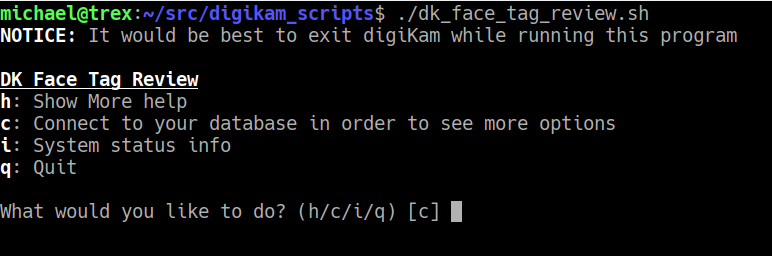
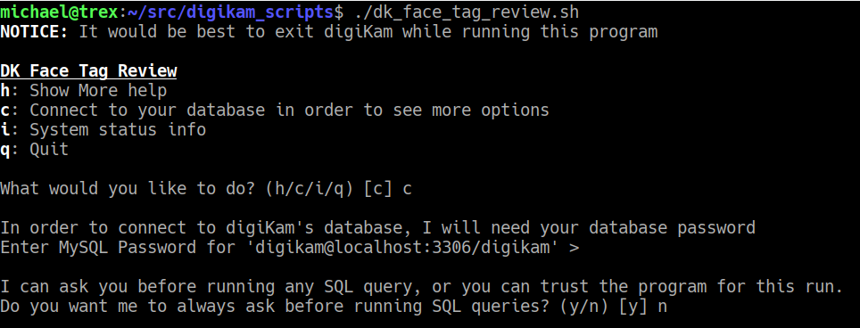
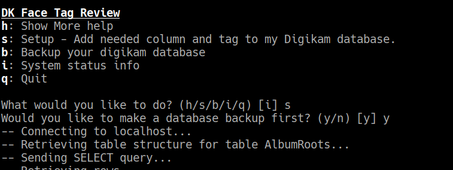
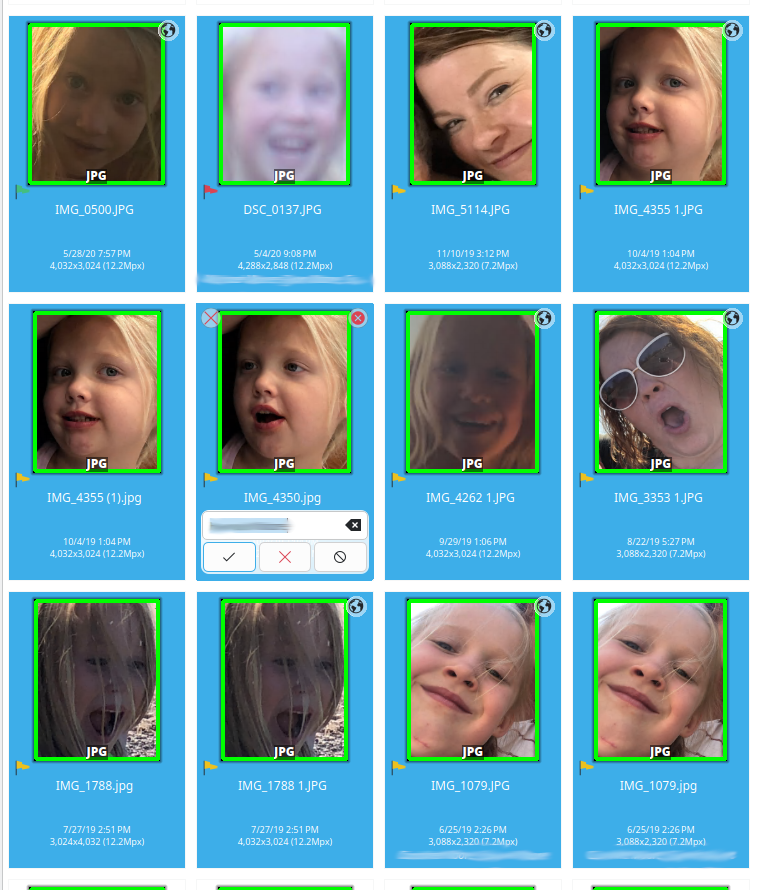
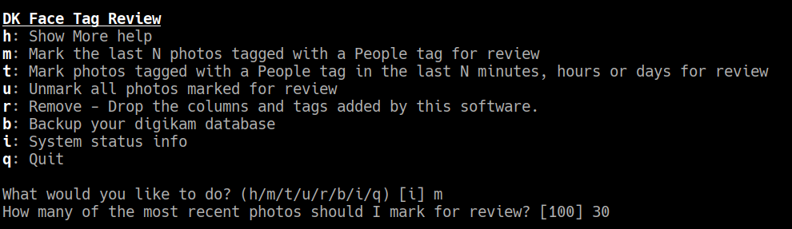
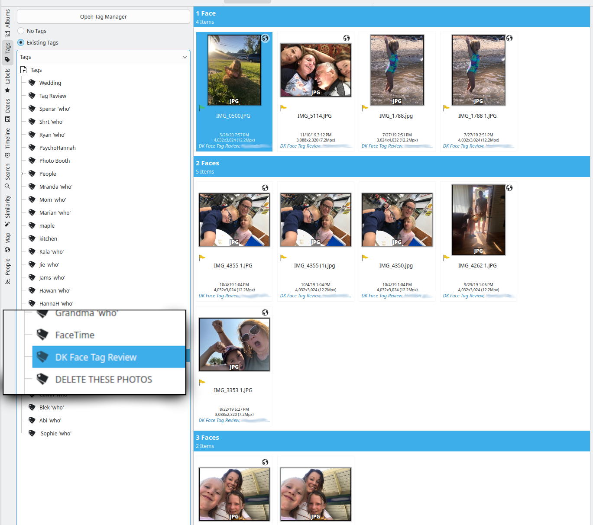

DK Face Tag Review
==================

This is a bash script/program that makes it possible to review recent digiKam
face tagging sessions. 

It is not official or supported by digiKam. 

What is the use case?
---------------------

* You know you made a mistake while tagging photos, but you can't find the photo
you just tagged. This is especially problematic if you are confirming suggestions
for a single person.
* Multi-user review - One person can do an initial pass, and a second user could
review the tagging
* Review in case of digiKam bugs (eg. https://bugs.kde.org/show_bug.cgi?id=499739)

I have hundreds of thousands of photos. Some of my People have 12,000 or more
photos tagged to them. 

As I tag additional photos, sometimes I type the wrong name, sometimes I have an
extra photo selected. Sometimes I'm tagging while distracted and just want to
double check my work!

digiKam doesn't currently offer *undo* or *recently tagged* type functionality
for face tagging. There also isn't a way to review recently tagged images.

This tool provides a way to find those mistakes or to review a tagging session. 

How it works
------------

The script has a menu option titled "Setup" which will add a new column
(`created_ts`) to the ImageTags table. New columns will have `created_ts` set to
the time the tag was added. 

Later, after a tagging session, you can come back into the script and add a
review tag (named **DK Face Tag Review**) to photos in two ways. 

Requirements and Installation 
-----------------------------

### Requirements

* Bash
* mysql MySQL command-line client
* mysqldump MySQL backup command-line tool
* A config file at ~/.config/digikamrc

This bash script assumes that your digiKam database is in MySQL, and that your
config file is at ~/.config/digikamrc. You will need the mysql client available
in your path. 

If you have tput in your path then the UI will have some bold and underline
added for easier use, but it is not required.

### Setup Exit digiKam. 

Download `dk_face_tag_review`, make it executable and put it somewhere convenient. 

Run `dk_face_tag_review`.

    Press `c` to connect to your database. DK Face Tag Review will get the
    database info from your digikamrc file. The password there is encrypted, so
    you will be prompted for your password. 

    After you enter your database password, DK Face Tag Review will ask if you
    want to be prompted before it runs any SQL. Press `y` or `enter` to see all
    the SQL. Press `n` to just trust what it is running. 

    When you ask DK Face Tag Review to run Setup, it will ask if you want to
    make a database backup first. This will be put in the current working
    directory. 

    After running the backup, a new timestamp column will be added to the
    ImageTags table.  

    You can now re-launch digiKam!

Usage
-----

    With DK Face Tag Review set up, you can now tag as normal. 

    When you want to review some tagging work, run `dk_face_tag_review`. 

    In the info we can now see that there are 61 markable photos. These are
    photos which have been tagged since DK Face Tag Review was set up. 

    I think I just made a mistake within the last few faces I tagged. 

    I can either mark the last N photos tagged for review, or I can mark all
    photos tagged in the last N minutes/hours/days.

    **NOTE**: All tags created before Setup is run are considered to have been
    created at the same time. If you run Setup and immediately ask
    **DK Face Tag Review** to mark 10 photos for review, all of the existing
    tags will have the same timestamp and order is not guaranteed.

    The images I marked should now appear under the tag **DK Face Tag Review**.
    I can now review each photo and correct any mistakes. I can either remove
    the **DK Face Tag Review** tag as I work through them, or I can use
    `dk_face_tag_review` to unmark them all at once. 

Features
--------

    * Makes it possible to see which photos have been most recently tagged with
    a People tag
    * Can mark photos for review by last N photos or last N minutes/hours/days
    * Has database backup script built in
    * Can clear the `DK Face Tag Review` tag from all the marked images
    * Includes script to undo changes to database

Questions
---------

    Q: I accidentally tagged 1000 faces as "John" which is probably wrong. Can
    this tool help me?  

    A: If you ran Setup before tagging, then yes! If you
    just found this tool, then run Setup now and we'll be there for you next
    time. 
